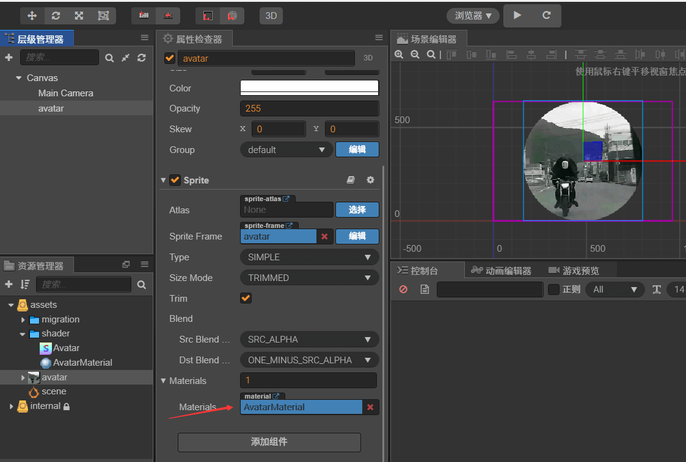
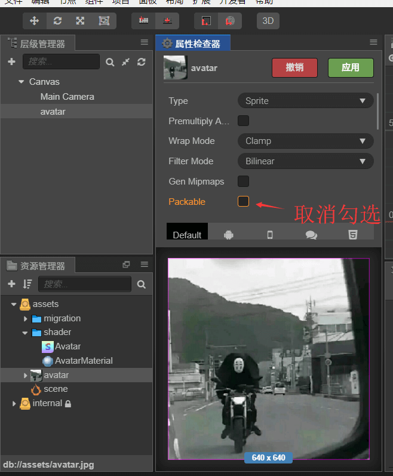

# Cocos Creator 圆形头像Shader使用


>如果你有更好的见解或者建议，欢迎您的提出。
---

## 目录
+ [创建Effect脚本](#创建effect脚本)
+ [创建Meterial材质](#创建Meterial材质)
+ [在对应图片节点使用Meterial](#在对应图片节点使用Meterial)
+ [补充事项](#补充事项)

<br>
<br>


### 创建effect脚本
_直接贴代码了..._

```effect
CCEffect %{
  techniques:
  - passes:
    - vert: vs
      frag: fs
      blendState:
        targets:
        - blend: true
      rasterizerState:
        cullMode: none
      properties:
        texture: { value: white }
        alphaThreshold: { value: 0.5 }
        edge: {
          value: 0.15,
          inspector: {
            tooltip: "圆角范围",
            range: [0.0, 0.5]
          }
        }
}%


CCProgram vs %{
  precision highp float;

  #include <cc-global>
  #include <cc-local>

  in vec3 a_position;
  in vec4 a_color;
  out vec4 v_color;

  #if USE_TEXTURE
  in vec2 a_uv0;
  out vec2 v_uv0;
  #endif

  void main () {
    vec4 pos = vec4(a_position, 1);

    #if CC_USE_MODEL
    pos = cc_matViewProj * cc_matWorld * pos;
    #else
    pos = cc_matViewProj * pos;
    #endif

    #if USE_TEXTURE
    v_uv0 = a_uv0;
    #endif

    v_color = a_color;

    gl_Position = pos;
  }
}%


CCProgram fs %{
  precision highp float;

  #include <alpha-test>

  in vec4 v_color;

  uniform Props {
    float edge;
  };

  #if USE_TEXTURE
  in vec2 v_uv0;
  uniform sampler2D texture;
  #endif

  void main () {
    vec4 o = vec4(1, 1, 1, 1);

    #if USE_TEXTURE
    o *= texture(texture, v_uv0);
      #if CC_USE_ALPHA_ATLAS_TEXTURE
      o.a *= texture2D(texture, v_uv0 + vec2(0, 0.5)).r;
      #endif
    #endif

    o *= v_color;

    ALPHA_TEST(o);

    vec2 uv = v_uv0.xy - vec2(0.5, 0.5);
    float rx = abs(uv.x) - (0.5 - edge);
    float ry = abs(uv.y) - (0.5 - edge);
    float mx = step(0.5 - edge, abs(uv.x));
    float my = step(0.5 - edge, abs(uv.y));
    float radius = length(vec2(rx, ry));
    float a = 1.0 - mx * my * step(edge, radius) * smoothstep(0., edge * 0.01, radius - edge);
    gl_FragColor = vec4(o.rgb, o.a * a);
  }
}%

```

### 创建Meterial材质
1. 创建 Material 文件
2. 使用创建出的 **Avatar** Shader 文件
3. 设置图片边缘为 50%
4. 勾选生效
5. 同上
> <div align="center"> <br> 步骤图<br> <br></div>

<br>

### 在对应图片节点使用Meterial
+ 将创建的 Material 材质拖动到 Sprite 组件上即可。
 <div align="center"> <br> 使用图<br> <br></div>

<br>

### 补充事项
 > 对于使用的小图，我们需要手动取消在贴图的自动图集选项。如果不手动取消，那么 Shader 的渲染顶着点就会错误渲染, 导致 Shader 的渲染异常。 (当然，你也可以用脚本手动刷新顶着点...学会了记得教教我)
 + 对于本地贴图，我们可以直接取消勾选自动图集选项即可。(见下图)
<div align="center"> <br> texture2D取消勾选自动图集<br> <br></div>

<br>
+ 对于动态加载的图片, 我们需要手动取消贴图为自动图集选项。

```ts
  let _url = "i_just_a_url";
  cc.loader.load({ url: _url, type: "png" }, (error,  texture: cc.Texture2D) => {
      texture.packable = false;   // 重点!!! 请注意我!!! 请尊重我!!!
      let spriteFrame = new cc.SpriteFrame(texture);
      this.spriteNode.getComponent(cc.Sprite).spriteFrame = spriteFrame
  }); 
```


<br>
<br>

### 最终运行效果
<div align="center"> <br> 祝你一次点亮~<br> <br></div>


<br>

_**源码地址:**_: <a href="./AvatarShader" target="_blank">AvatarShader</a>